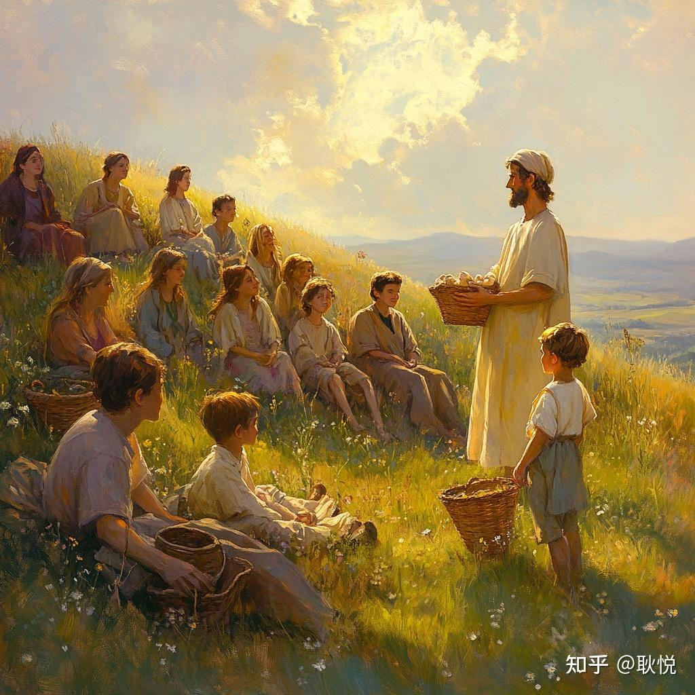
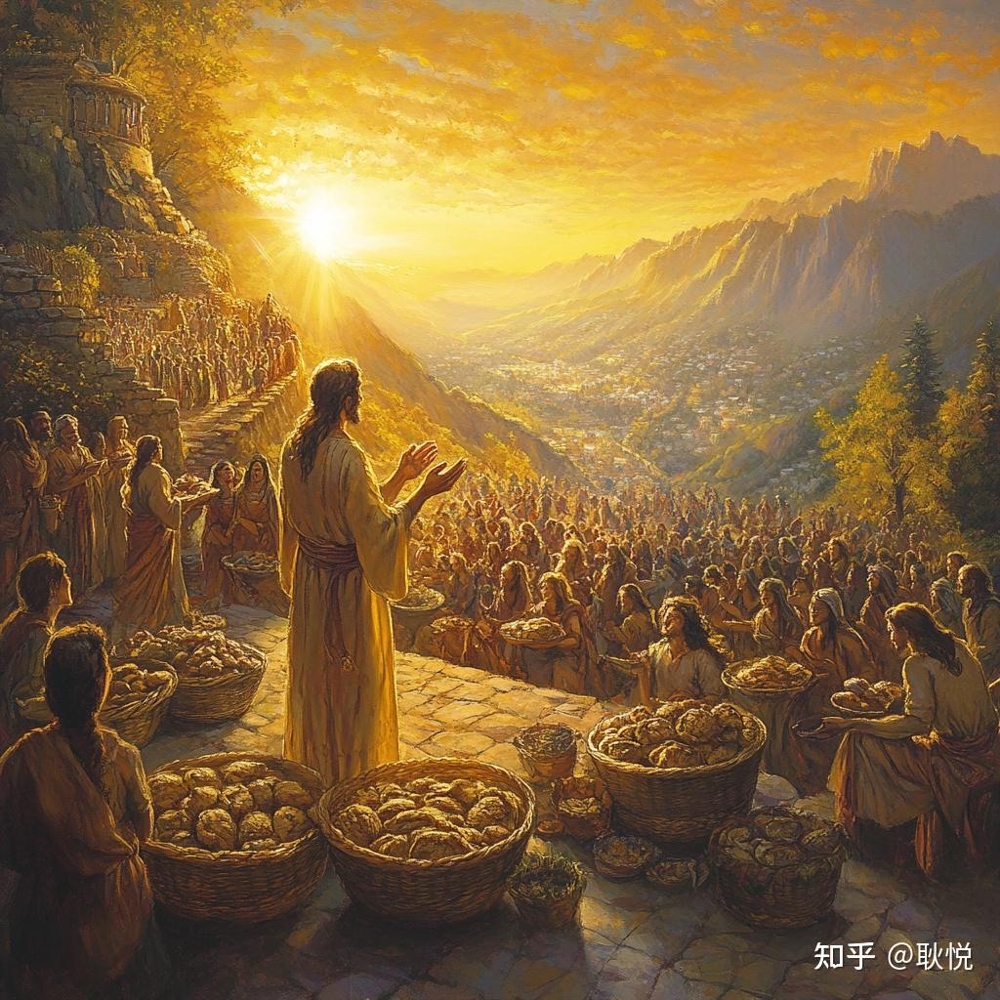
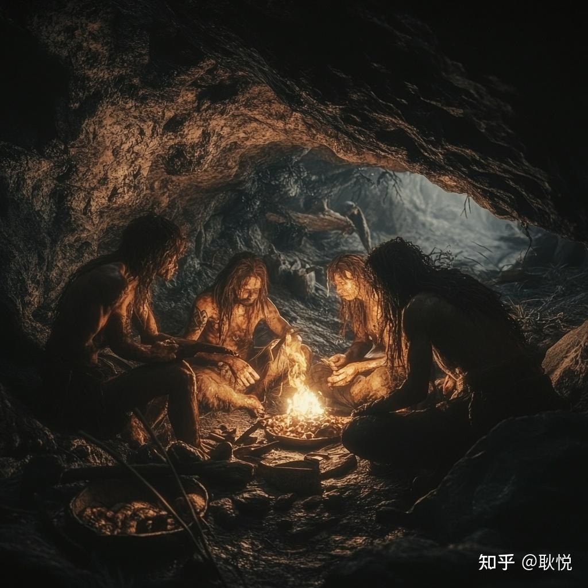
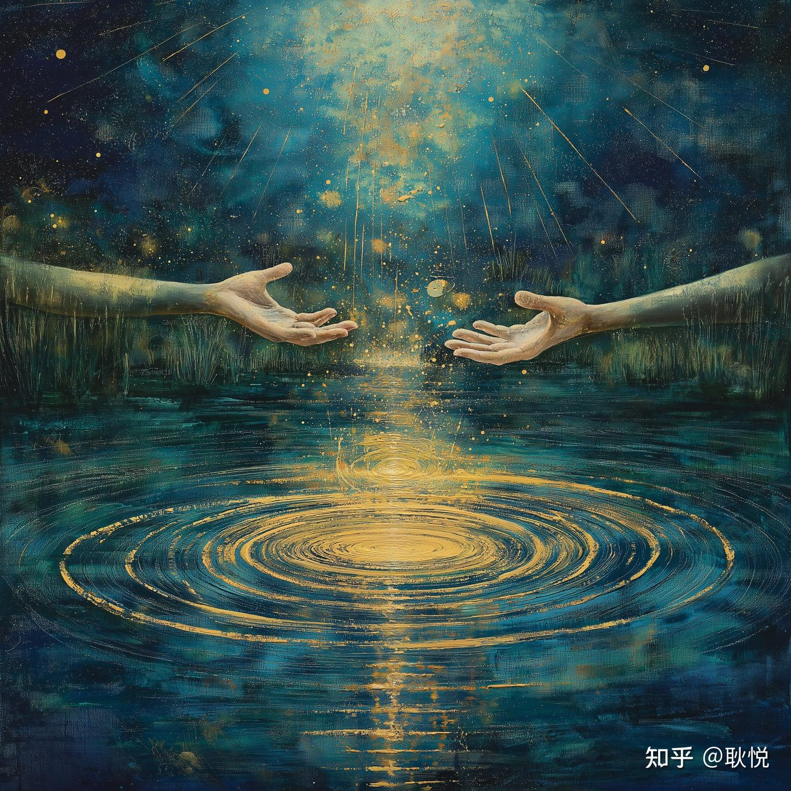
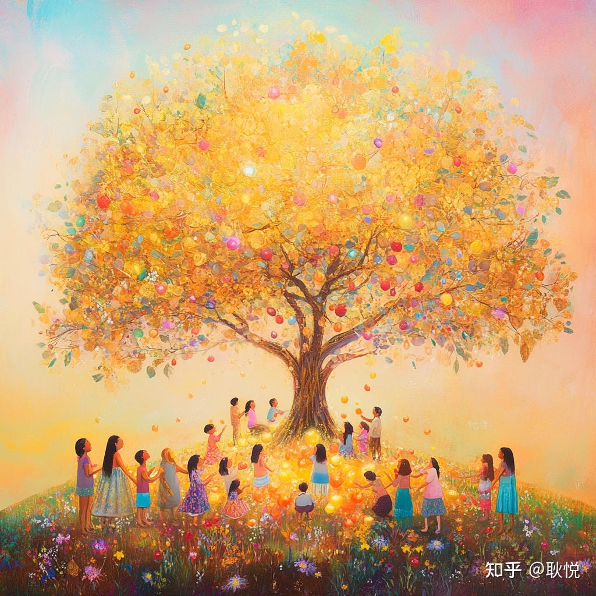
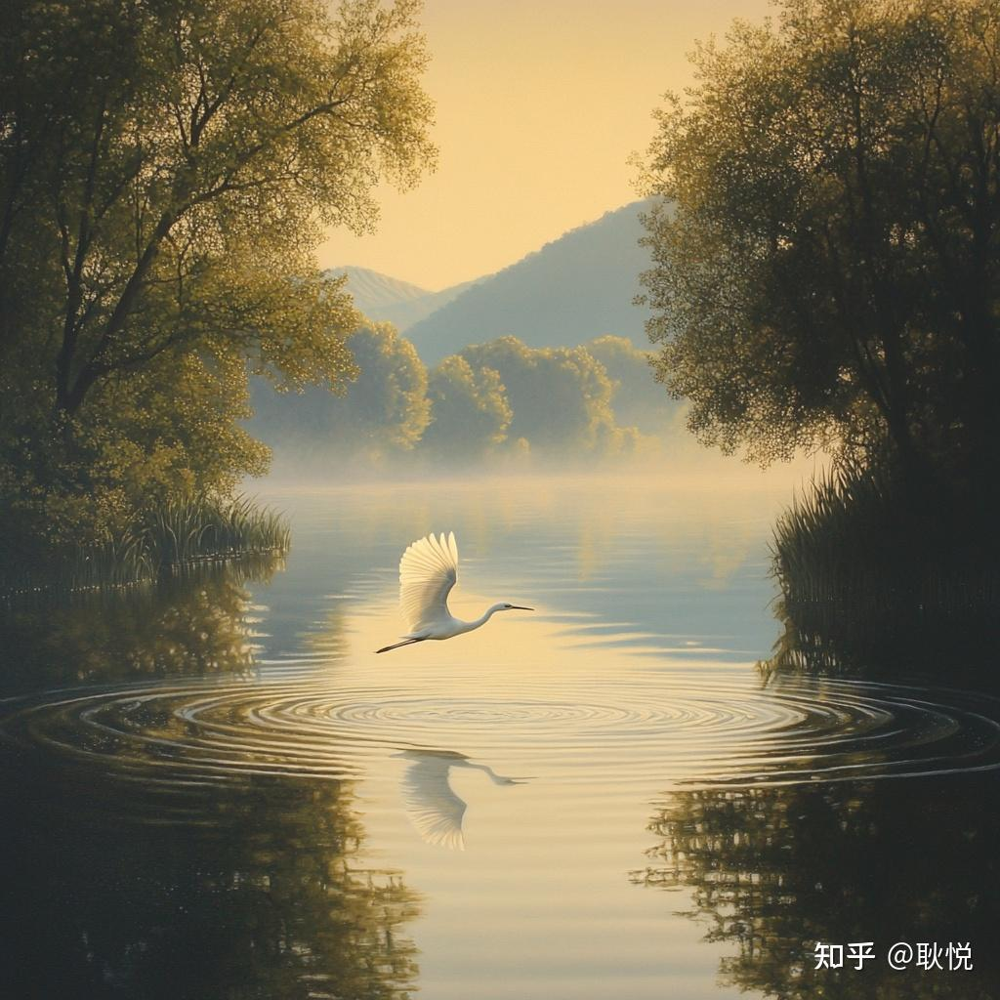
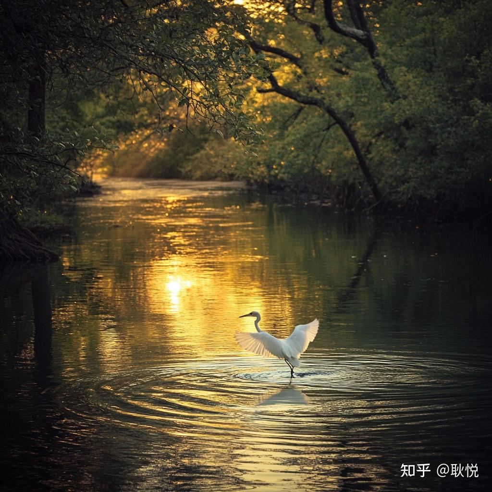

# 五饼二鱼：让爱慷慨地流动

那天看了「面包和鱼」，改变了一个现象级宗教历史神剧《The Chosen》导演 Dallas Jenkins 人生命运的故事。

他曾倾尽全力拍摄一部大制作的电影，却在上映当天遭遇惨败，整个人跌入低谷。

这时，一个多年未联系的朋友发来简短的信息："上帝让你去做面包和鱼。"

这句话让他逐渐找回了本心，以纯粹的信念重新创作，最终找到了属于自己的天命，也取得了世俗成功。

如果你感兴趣，可以去看 Jordan Peterson 的一期播客，信息密度极高，非常精彩。

## 五饼二鱼

这个神迹让我对"五饼二鱼"产生了兴趣。

我以前听过无数次这个名字，但这一次才追溯了它的来源。

如果你是第一次听，可以试着想象一个暖洋洋的下午：

数千人聚集在山坡上听耶稣讲道。

人们席地而坐，脸上带着对知识与神圣智慧的渴望。

孩子们在草地上追逐嬉戏，妇女们安静地倾听，男人们被耶稣的话语深深打动。

随着日头渐渐西斜，众人感到饥饿。

门徒们焦急地对耶稣说："这里这么偏僻，大家没吃的东西，该怎么办呢？"

耶稣平静地回答："你们去看看有什么可以分享的。"

门徒找到了一个小男孩，他的篮子里仅有五个大麦饼和两条小鱼。

这是他母亲为他准备的晚餐，但他愿意将它献出。

你可以想象那个小男孩的心情。面对数千人的注视，他可能感到害羞，但耶稣温暖的微笑让他鼓起了勇气。

耶稣接过篮子，双手举向天祷告："感谢天父，赐予我们的这一切。"

在那样微不足道的资源面前，他没有抱怨，而是选择感恩。这种信念深深感染了在场的每一个人。

接着，耶稣开始分发食物。

门徒将饼和鱼分给前排的人，前排的人再传递给后排，像溪流一般流动开来。

神迹发生了！食物不仅没有减少，反而源源不断地增加，直到每个人都吃饱。

## 十二篮

人们吃饱后，耶稣吩咐门徒收集剩下的碎片，装满了十二个篮子。

这些碎片不仅是神迹的见证，也是对珍惜的提醒。神的恩赐虽丰沛，但人类需要学会感恩与节制。小男孩的慷慨成就了这场神迹，而耶稣的爱让每个人都得到了满足。

## 一个人

2024 年，我曾有一个顿悟：一个人只要活着，Ta 的存在就会带给一些人平静。

比如，你活着，你的家人和朋友会因为你的存在感到内心安宁，而不是因你在宇宙中消失后的悲伤。

也许你未曾察觉，但你的存在，可能已经让某些人的生活变得更好、更幸福。哪怕只有一小部分，这也是存在的意义。

昨天在知乎看到一个问题："觉得自己的成就感很小怎么办？"

一个答案给我启发：你能给一个人带去祝福，就已经很好了。

人只要认真活着，对周围的人的影响就已经难以估量。你的存在，默默传递着这样的讯息：善良、用心、认真，是一种真实的力量。

## 千万年前

人类文明的开端，或许正是从一个智人祝福另一个智人开始的。

在伊拉克沙尼达尔洞穴（Shanidar Cave），考古学家发现了一具尼安德特人（Homo neanderthalensis）遗骸，距今约 4 万至 6 万年前。这个个体全身多处骨折、牙齿缺失，已丧失自理能力，却在这种情况下存活了数年。推测他的同伴不仅与他分享了食物，还精心照料他，使他得以延续生命。这种共情和协作精神，反映了早期人类对生命的尊重与依赖。

同样，在中国北京周口店的山顶洞遗址中，考古学家发现了约 1.8 万年前的墓葬遗迹。在这些墓葬中，逝者身旁常被放置穿孔的兽牙、海蚶壳、小石珠等装饰品，并撒布赤铁矿粉末，以表达对生命的尊敬和纪念。这些发现表明，早期人类已具备初步的宗教信仰和审美观念。

从古至今，从微小的个人行动到宏大的文明发展，都被一种美好和希望的主题贯穿。

这些史料，让我们看到爱与共情从远古便已深深根植于人类心中。

人类正在这样彼此合作，彼此祝福，彼此滋养，从猴子一步步进化成长，最终绵延到今天的人文。

## 爱的流动

爱可以传递，可以扩散，在流动中变得无限。

这篇里说的爱，不仅仅是某一种人类情感，比如爱情。而是 LOVE，是宇宙间的珍贵能量。

凡是我提到的「爱」，都更偏向这种。

内心丰盈的人，能够将接收到的爱，转化为更多的爱，分享给他人。

而这种分享会像涟漪一样，逐渐扩散，影响到更多人。

这也许就是传说中的"爱会流向不缺爱"的真正内涵。

金钱也是一种能量。当我们选择给予、投资、流通，而不是一味攥紧，它的价值才能真正显现。

小男孩的慷慨带动了神迹，他没有因为分享而失去，反而得到了更多。

这种流动的哲学，不仅适用于爱，也适用于我们生活中的每一种资源。

## 丰盛思维

这个故事，还有一种丰盛的思维：

无论资源多么有限，只要选择信任和分享，生活的丰盛总会超出想象。

爱和资源的流动不是简单的"付出与回报"，而是一种循环的秩序。

一个人给予的善意和感恩越多，帮助他人的意愿越强，生活会用意想不到的方式给你馈赠。

## 万物你我

刚搬到四川时，我曾有天傍晚在锦江水边漫步时候，看见白鹭低飞，

想起苏轼的《赤壁赋》：

"惟江上之清风，与山间之明月，耳得之而为声，目遇之而成色。取之无禁，用之不竭。"

那一刻，我感受到人与万物的连接。

人类文明的发端，在于祝福。或许，这也是一种归宿：

当一个人开始祝福世间万物时，Ta 便已融入万物之中。

我们，也是 Ta 们。

我们，就是万物。

祝福，不是单向的给予，而是融入生命本质的本能。

这篇也代表我新领悟到的点，

我的确是一个很容易把能量慷慨给到他人的人，这一度让我频繁遭遇到失望后，觉得不值得，很多时候觉得真诚待人反而都带来了报应。

我内心真正解放的，是学会放下，将爱与祝福投向整个世界。

## 慷慨神迹

当我想着五饼二鱼的温暖故事，当我写着古典乐分享时，

比如梅西安《时间终结四重奏》时，感受到人类在绝境里用音乐对同伴的互助。

这份感受尤为明确。

我们聆听几百年前的古典音乐，依然会感受到光亮，

这种传递，也是一种爱的慷慨流动——作曲家竭尽全力地燃烧创作激情，

在过去为人类的苦难、希望或爱写下音符，而这些音符在今天依然能够触动我们心灵，让我们在孤独中找到共鸣，和力量。

每一个用心创作音乐的人，都是在用自己的五饼二鱼，祝福着世界。

Ta 们未必见过我们，却通过音乐给予了我们关怀和能量。

每一个在世间跋涉的，思考的，活着的，离开的人，都是如此，

边痛苦，边祝愿，边疗伤，边前行。

所以我还是会慷慨地传递爱，怀着信任和分享的心，

相信生活的丰盛总会远超我们的想象。

这也是一份有爱的文字，我想以这个故事提醒自己，

一个人活在世间的经历，做事，和抵达，

一部分取决于你的心念和行动，一部分来自于机缘和运气，

但很关键的，是那份你祝福他人的心志，和意愿。

We Find Love in Hopeless Places. ❤️
