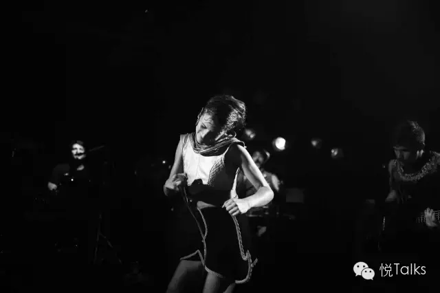
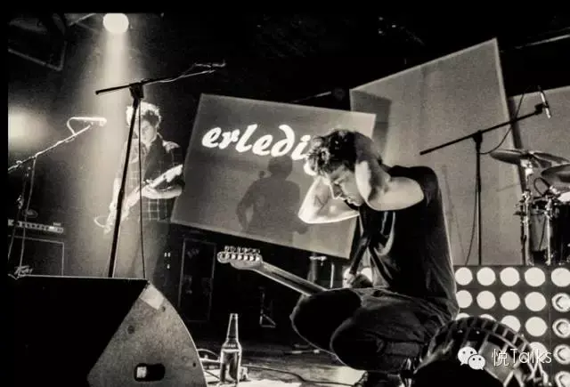
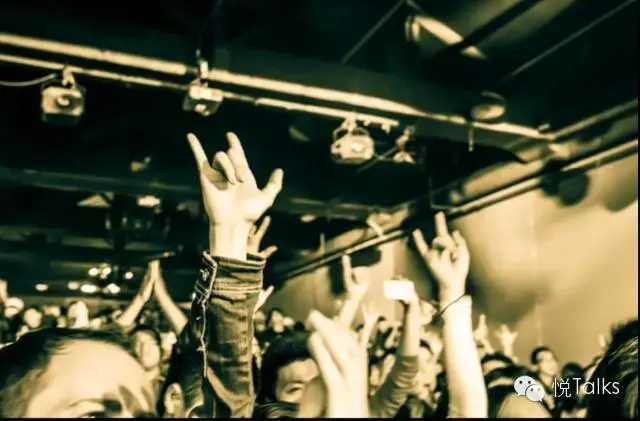
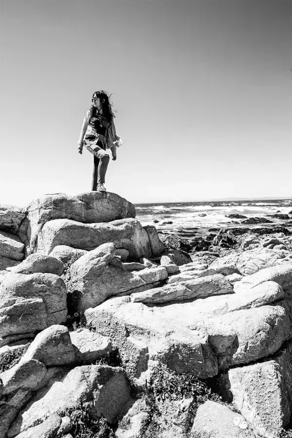

# 你会从天上漫着的云朵上，走下来

青春是一条静水深流的河

上周的一天下午，去三里屯和几位做美食的导演聊天，他们想挖掘一些故事，我回想着在北京的漂泊往事，对方说，你应该很喜欢摇滚吧，感觉是这样。

我笑了，窗外的光线洒进来，落在肩头，某段回忆在混沌的午后时光里沉潜。

在几年前的夏天，我和我的大部分朋友们都是文艺青年。

我窝在蜂巢剧场和木马剧场，看完了在那个夏天上演的几乎全部的话剧。每天下班后，会看一部电影，有一个月，我在看伍迪·艾伦、费里尼，然后看杨德昌和侯孝贤....沉浸在那些年代日远的迷人故事里，日子一天天鲜明温柔。

有一次，北京下很大的雨，我趟着水去麻雀瓦舍听民谣，鞋帽尽湿，歌手是位盲人，走到台上说了一句，好的音乐能把你们的衣服和心烘干。我一边听，一边在黑暗里一起念，青春是一条静水深流的河。

也听演唱会，Bob Dylan，Suede…在那些下班的晚上和周末四处转，点滴的愉悦。

有一阵，我有点迷恋抓拍很酷的摇滚歌手的瞬间，在愚公移山、Mao Live House 看外国小众歌手的演出。去年五月，我和 Killar，流浪汉等朋友跑去迷笛音乐节做官方摄影师玩，三天从早拍到晚，在歇斯底里的尖叫和点燃的火焰中精疲力竭。

年轻的灵魂，在各个角落成长，从北五环或者西四环，汇聚到东四的胡同里，亮马桥的汽车公园里...恋爱、游泳、散步、请客吃饭、在月光下弹吉他听歌，在路边的烤肉摊撸串喝酒，在每一个咖啡馆流泪告别。一群人在只有一盏路灯的草地上跳舞，轻盈欢快，芬芳招展。

那好像是一个时代，你飘在云朵上，云上的日子，让你忘却阳光下的心事。

今年，我搬到了双井附近，自己做饭，每日健身，工作生活平衡，那些充斥在我生活中的活动、演出、喧闹变得不再重要。

不再喜欢话痨般地说话，似乎说出来，内心深处里有一片东西就挥发在空气里，安静才能养气。生活里多了些专注、内省的时光，顿觉平淡的时光非常奢侈。

有一天，我发现自己就住在麻雀瓦舍旁边，但是，我似乎再也没有去关注过一场演出，只是在附近喝过一碗粥，买过几回菜。

那些弹琴把老歌唱的夜晚，那些笃信永远年轻永远热泪盈眶的时光，离开了我。这变化就在一瞬间。

它悄然来临，我全盘接受。

也许，人年轻时的文艺，有时候很像一种情绪的渲染，在寒冷的草地上和一帮人挤在一起为乐队喊的嗓子嘶哑，喝一罐味道一般的啤酒，就觉得好 High，那只是青春的一种吧。

现在觉得，当你把生活过的很好，不论冷暖，你都能把自己照顾好，为自己随时能做一餐热气腾腾的饭，内心更加强大，判断力更准确，你仍然可以选择更多优质的文艺生活，更精致和优美的艺术去欣赏，这也算是越来越好的自己，重要的是，在成长的每个阶段，你都做了尝试了那个阶段你最想做的事情，就不遗憾，就往前走。

真的，文艺的青年，总有一天会长大，会从天上漫着的云朵上，走下来，不再是不食人间烟火的模样，她踏踏实实站在地面上，热爱生活，拥抱生活。

