# 教妈妈学视频剪辑

从刘女士到刘导

---
短视频剪辑/拍摄。 因为短视频这件事，偶然竟然改变/提高了我妈妈的生活质量。 我妈从她们微信群里一位低调不怎么喜欢分享的刘女士， 变成了大家热爱而期待的才华刘导， 哈哈哈哈。她做视频不亦乐乎。 在我写这篇知乎回答时，她还正在认真地给姐妹们制作一个3.8仪式感节日视频。/ 我妈说她因为内向，本来从不爱在社交场合台子上说话。 但是现在大家聚会，都要让她说两句，说这是我们刘主任，是我们技术人才。 重点是她作为创作者，感到好快乐。 也算一个福气吧。 觉得我学会视频这事儿，对朋友对家人都有如礼物。

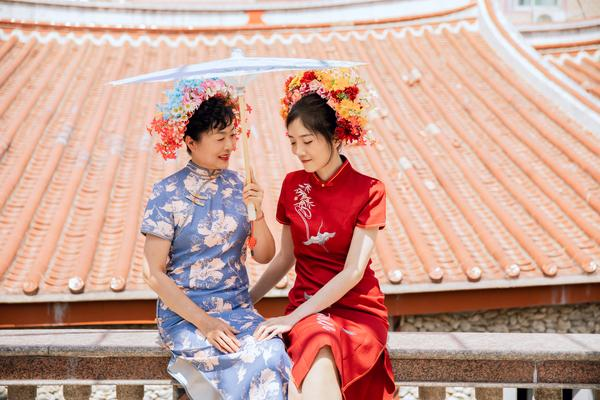

来说说，看到这个问题， 其实最开始谁也没有这个心思，y q那年我不是在家乡呆了几个月嘛， 等到能出门时候，妈妈的几个老朋友一块出去玩，回来后给我看，她们去了哪里， 就很高兴，但手机拍的摇摇晃晃的视频， 我说，哎呀，这都是啥，我给你们加个音乐剪辑下做个小视频吧。
很短，也没有弄什么特效。
然后做了三个，没想到，发她们群里就炸了， 阿姨叔叔们，说那天在家躺床上，播放了六十多遍， 然后还发给她们在各个省的朋友们，说， 你看，我美不美，我觉得自己像个明星一样，咋那么好看。
哈哈哈哈哈。
/ 她们当时每天晚上会去走路散步，那天傍晚见面汇合时，一个二个，都说自己今天看手机看的眼睛疼。
回来我妈给我说的时候，笑的不行。
让我想起，我在家呆的时间也变得多了些意义。
我妈很好学，她就问我，你能教我嘛，你剪我在旁边看，能学会不。
她趁我在家那阵，学会了剪辑视频，用手机。
接着她就摇身一变，成为我们家小区和那个好友圈里的「名导」了（justkidd ing）哈哈哈哈哈哈。
/ 她那帮朋友们因此会更加喜欢出去玩， 而且几乎每次出行都很期待她去，因为她会弄出来一个带着照片音乐那阵视频。
其实我看着她做的视频，是有点土味的。
但是呢，特别质朴可爱，每次看着都很开心。

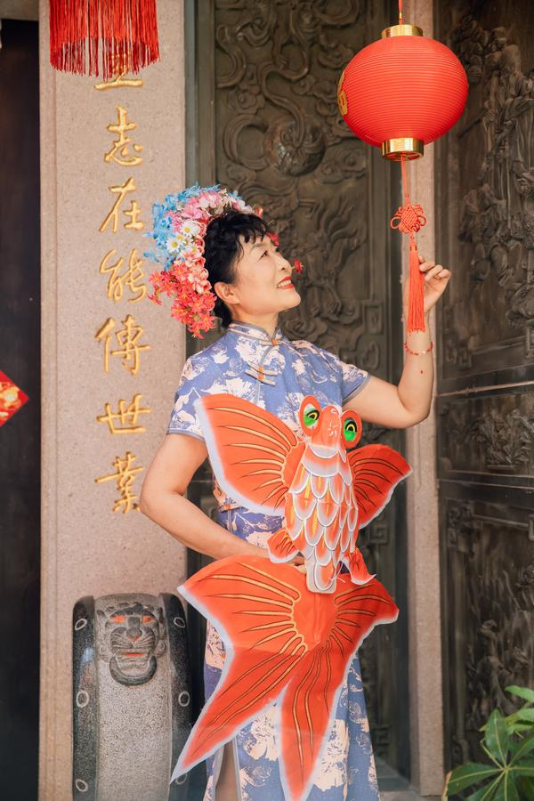

而且我妈感觉生命被点亮的感觉，就是她从平常漫无目的的刷d y，打发时间。 到好奇心那样去找，用创作者心态，几乎看的视频都是下次出去玩的灵感积攒。 还会策划，接下来去哪里。 一出去玩大概回来就做视频，第二天她们那个群就会超级激动，刷屏一样地称赞她。 她真的好快乐哦。 每一次跟我说视频都是洋溢着开心喜悦那种。 我给她的教学方法，是特别生活化。 没有跟她讲过一个术语，都是生活比喻。 “你就像切菜一样，把那根很长的山药，切成几段短的。” 这个意思，就是切割。 “现在音乐平了。就跟没有味道的羊肉串一样，你加点有韵律的音乐，就像有了孜然。 就更好吃，有情绪和味道了。” 新疆人秒懂。

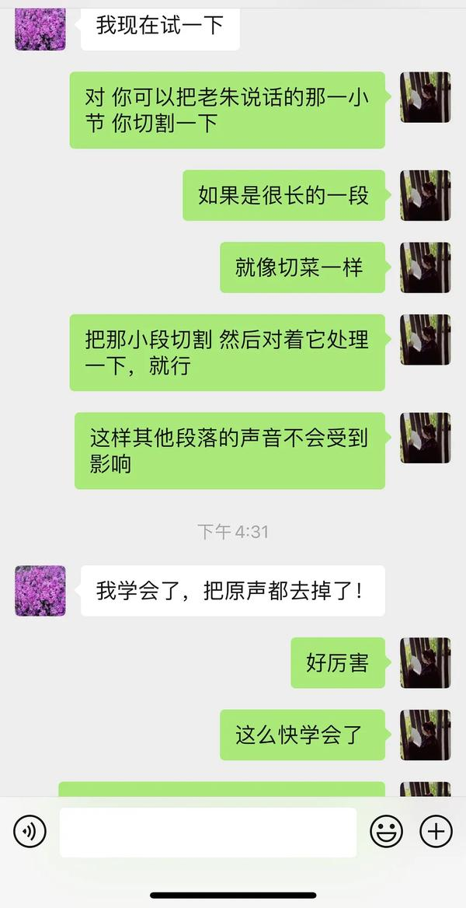

说之前，我在想我要不要说的这么细，甚至有一些还是专业点的知识。 我只想让她从做视频里感到快乐，而不是那种pu sh，指责，或者压力。 就是自己摸索的那种快乐。/ 也会被我妈咪吓到，悟性很好（我应该遗传了哈哈哈）， 就跟个小飞机嗖嗖嗖毫无止境那种往上升。 对她的改变 我妈好开心，三天做一个新视频，大概五六分钟。 她们也已经成了一个行动密切的小分队，几乎大家都排队报名要一起去玩，因为知道 有人拍照，有人做视频，衣服裙子还统一每次（我都被这种行动力惊到）。 除了y q那一阵，后面经常组队出去旅行玩，而且每个人都好开心。 我点开视频也开心，像连续剧一样。 我妈也很聪明，对我，有那种暗喜的友军感。 就是她每次感觉出去都胜券在握，都超级自信。都知道我又可以玩得好，又可以拍的好。 修改日常 她每次制作好后，都会给我先看一下。 我平常在忙的生活就是会心一笑，有时候说一点也会调整。 截图随手记录一下当时感触。

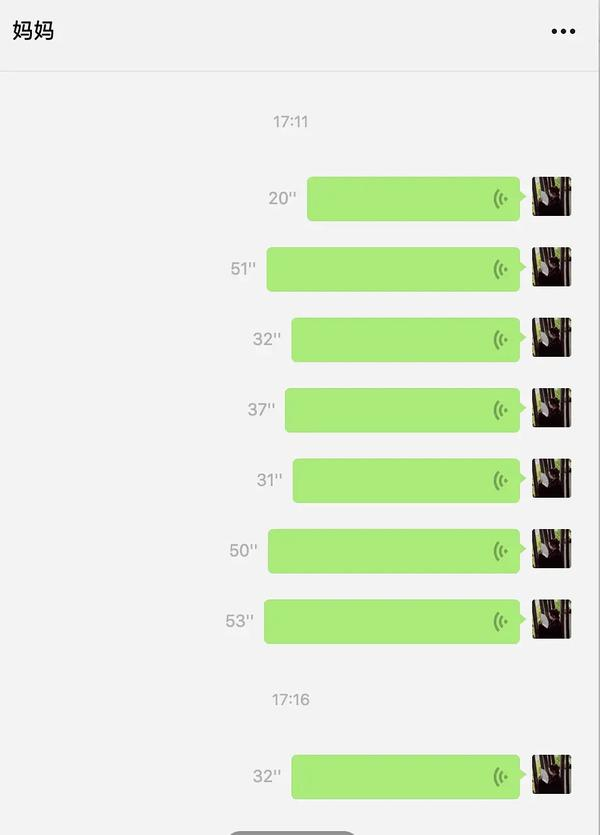

我在外地 远程就给她发语音说每一个修改点问题在哪里 她每次做完随手发给我，说，点评一下，来，耿老师。怎么改进。 有时候，我就顺着说了。 她就去对应修改去了。

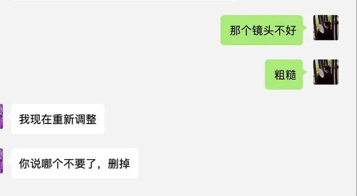

随口说这个适合个啥音乐，或者你稍微镜头怎么调一下。 她就去搞。

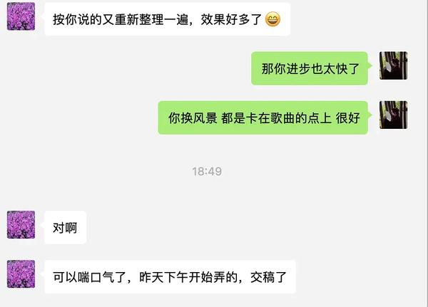

大概也就半个小时。 她就改好了。 我记得有一次我在吃饭，其实我一直感觉做视频就是陪着她玩，也没怎么在意。 结果我每次点开，都有一种卧槽我惊了，

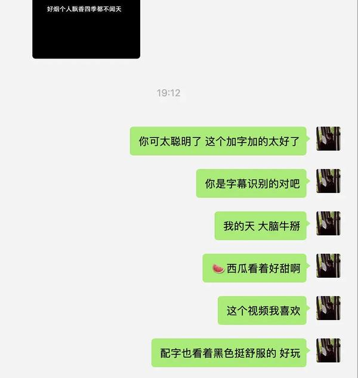

她「一点就透，悟性极高」，很会触类旁通

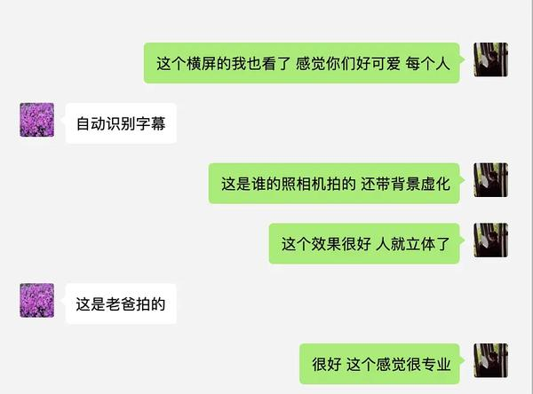

搞的超级利索。立竿见影。

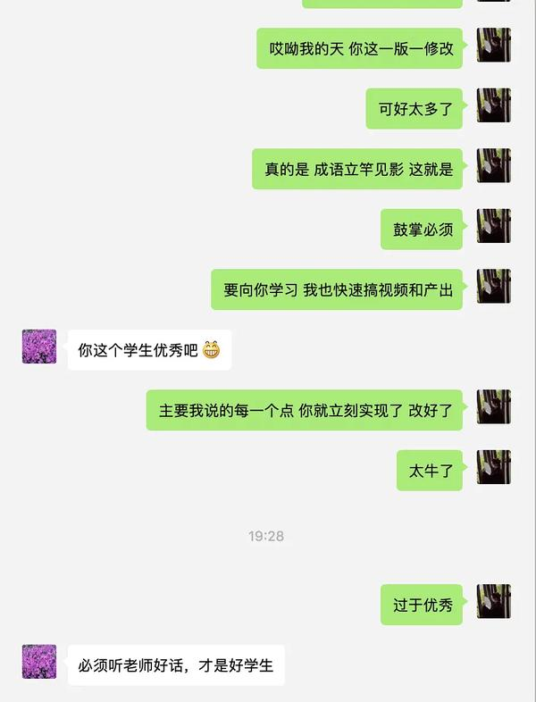

她从来不会因为建议而有挫败感，而是非常喜欢快速修改。 每次都会添加新的滤镜，和画框，关键帧等。 我觉得每一个绚丽的效果，可能都还需要去找一些按键之类的， 她也不嫌麻烦。会随着好奇心去点击各种效果去尝试。 然后搞完发到群里，大家就开始刷屏膜拜哈哈哈。说你真能啊。你咋做的恁好。之类的。 有个好学的阿姨甚至天天上门堵门，说你怎么进步那么快你咋弄的到底是。 阿姨叔叔们，因为我是我妈咪的隐形外挂呀。哈哈哈。 其实y q回家之前，我还很有压力，因为我想到没过传统体制内生活的缘故， 想到是会给到爸妈在那个朋友圈子的压力的。 但因为视频的共同语言，现在那个圈子，都超级期待我爸妈要去参与和组织的旅行。超级兴奋。

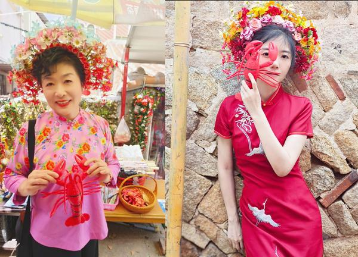

妈妈随手给我拍的 龙虾照 当时那三个视频第一次分享给她们群里之后， 她们那晚除了很兴奋，站在我家楼下讨论的主题就是， 怎么能说服我，让我愿意和她们一起去旅行一次，给她们亲自拍一些照片，制作一下。 接着呢，各家纯朴的阿姨叔叔提着一篮子鸡蛋，自己种的蔬菜，鸡腿送上门来，递给我， 说谢谢你啊，给你补充营养哈哈哈哈哈哈。 其实咱们也并不算是多厉害那种，或者技能特别高， 也就是自学会了点，然后对t a们来说刚好够用，就多了这么一份乐趣。 因为我之前一直觉得我妈还可以吧，算挺灵光的一个人。 但是她太浪费时间了，天天在看d y，看各种电视剧，或者综艺消磨时间。 虽然她和我都是双子座对捕捉信息是灵敏的， 但就学视频这个过程，从无到有，从刘姐到刘导， 我才感觉到她学习能力太牛X了。

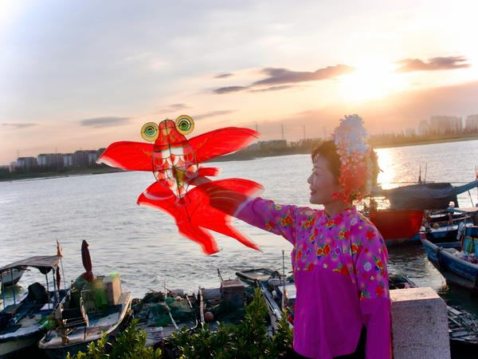

学会了一个技能， 只是这么小的一件事。 我妈现在明显比过去几年有成就感。 当一个人感受到创作的快乐，和他人很需要她，形成正的反馈，那种感觉是不一样的。 人能任何时候学习都是不晚的，

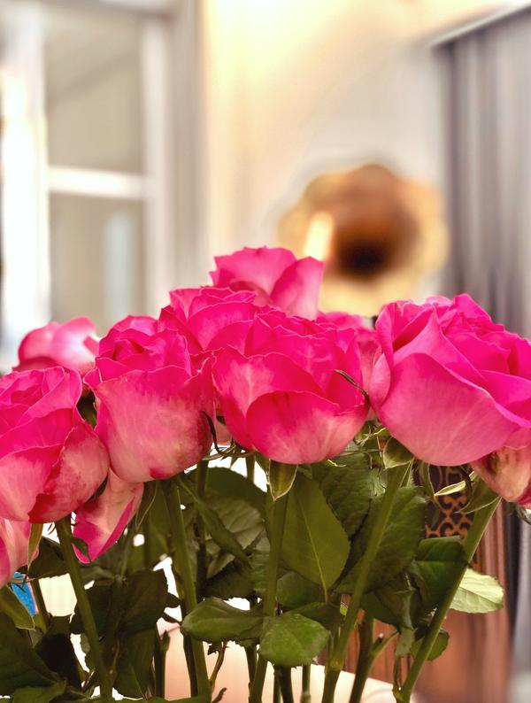

祝妈咪三八节快乐 我原来是遗传了她（不是自夸），就是这件小事的旁观。 我tea ch过的几个学影视专业的实习生/编辑或者机构里的从业者，都莫得这个悟性和快速自我修正。 也不是夸我妈，这毕竟是六十岁出头的脑子。 没有任何传媒知识。 纯零基础进入。

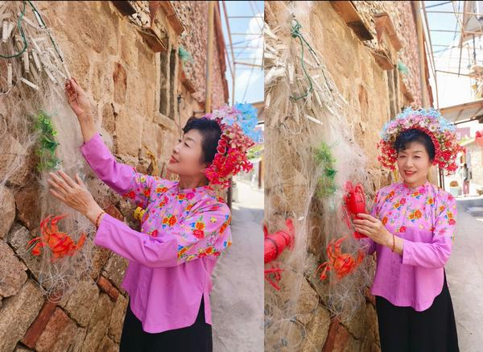

牛掰。佩服。resp ect。 很高兴看到她充实而快乐的使用时间哈哈哈哈哈，生活因技能和学习，真的会改变 

---

## 版权

本文为耿悦原创，版权所有。未经许可不得转载或商业使用。
