# 《繁花》· 用沪语思维保存上海记忆

金宇澄的创作初心

---
在上海拍摄，《繁花》才是对味的，灵魂底色。 作家在造梦，创造出一个自己不想忘记的世界。 这个是用上海话书写的一个小说。其实呢这是一个用上海话思维的，一个改良上海话的小说。」

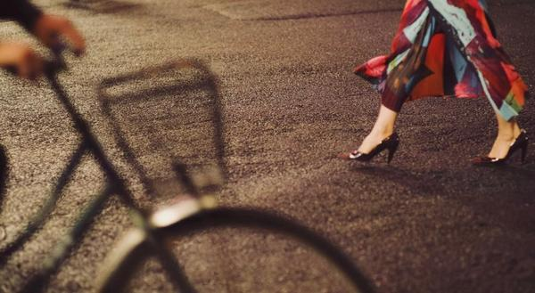

这组剧照拍的蛮有氛围的 你眼里的《繁花》，黄河路，昼与夜，颜色，光影， 是王家卫镜头下的命运交织的群像， 凭武侠内核和美术功力， 精雕细琢出的市场经济旧梦。

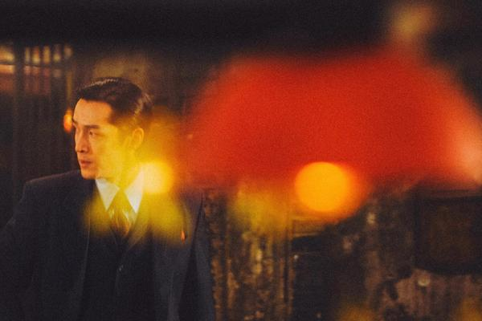

女性活色生香的美丽和曼妙，命运的曲折与缱绻， 有能看得清的景色，和说不清的心事。 而在金宇澄的创作初心里，他在尽可能 传承/保留上海记忆的细节。

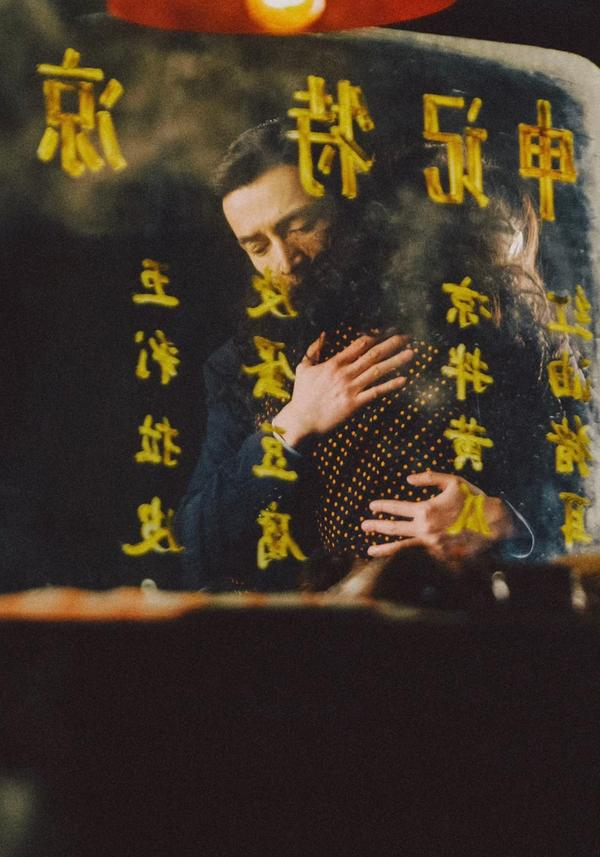

宝汪有点虐，我看到汪小姐这都看不下去了 我在看《繁花》前一两天了解了一下作家， 看了一些采访，才明白他为何写《繁花》， 当读完他的创作故事，我有些都被打动。 他 在保护上海的文化，里弄的细节，空气里弥散的气味和湿度，闲谈，沪语（这个对他很重要）。 你能感受到一种很深的对城市和正在逝去之物的情感和爱惜。

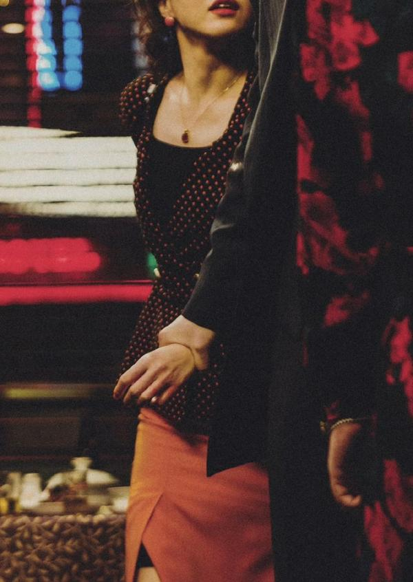

从文学上来说，他在改《繁花》的时候，初衷就是想加强我们传统这一块的内容。 因为他感到在五四新文化运动之后，我们学习的都是现代白话文，或者看翻译的文本。 他觉得在这两种国语的熏染之下，感觉到了无力。

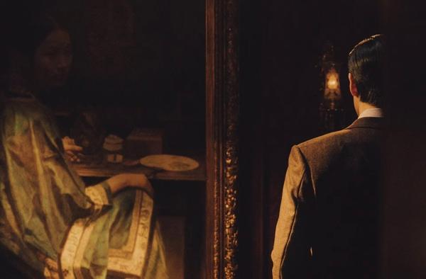

「你感觉无力的时候，你就要去传统里去寻找力量。」 好像那些有价值的旧的老家具蒙上了灰尘，被贱卖不被珍惜，或者正在消失。 那些正在被我们忘记的东西，在五四之后摈弃掉的这些东西， 他在想，我们是不是可以把它放在一个小说里边？

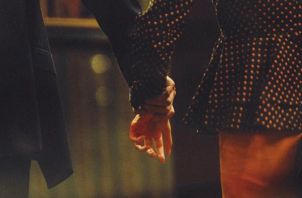

第一次慕名打开《繁花》小说时候，说实话我读了两章觉得很不适应。 不是很明白为什么要这样说话，这样排版。一度有些读不下去，就搁置了。 看了他创作故事后才明白他的用心良苦。

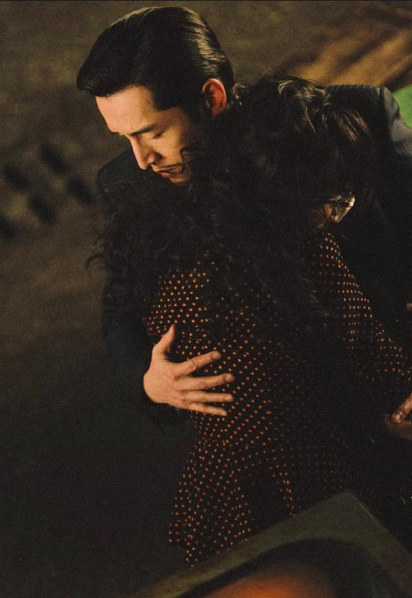

我要做一个沪语思维的小说 金宇澄在修改《繁花》的时候，用了中国的文化元素。包括它的内容方面。 上海话在目前这个形势下边，和过去起了很大的变化。 上海在一八四三年开埠之后，到一九三零年，它的人口大概只有三百多万。 在这个之后到一九九零年的话，大概已经有两千多万。所以说呢，大量的外地来的人进入上海。 那么一九九零年之后，这个局面是什么样？

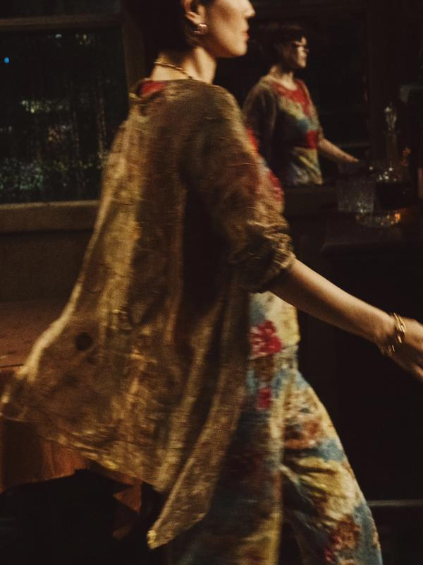

此篇的配图均来自剧照师Pho To T o拍摄的繁花片场图 就是说是大量的富豪进入上海，大量的局一级的干部进入上海，还有大量的我们的学生大学生，都是大学文化以上的优秀的人进入上海。 那么刚才说到的普通话，他们都是受普通话的教育。 在一个我们几代人都接受普通话教育的这么个背景下边。 他如果听到说上海话，他肯定会非常理直气壮——请你说普通话。 所以我要做这个，为什么我要做一个沪语思维的一个上海的小说。 就是因为什么，就是要把里边，外地朋友看不懂的上海字全部去掉。

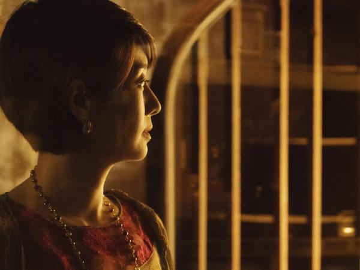

以下是访谈我看到的一些句子。 许知远：因为压抑和封闭而产生的创造力，我们应该用什么心态来面对？ 其实这背后有巨大的残忍，但又可能构造出新的情感方式。 您作为一个创作者怎么理解？ 金宇澄： 可能我是写作者，我看见稀罕的东西， 就想最好能够让大家都看到，能有这些对照来修正我们现在的生活。 我们要把过去这些东西保存下来，不要忘记过去。 我对文学的理解很简单，文学就是把过去的生活方式、人际关系保存下来。 比如《金瓶梅》，如果没有这本书，我们根本就不知道明朝那个时候的那种生活。 文学起不了什么大的作用，不能直接推动社会，我个人觉得能够保存过去的东西就是一种推动。

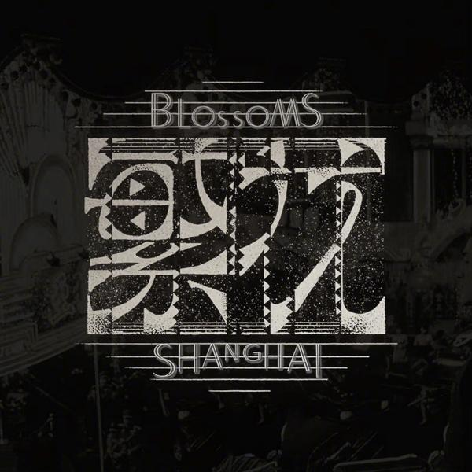

翻开《繁花》，每一位读者会看到的第一章节的开头， 壹 阿宝十岁，邻居 蓓蒂 六岁。两个人从假三层爬上屋顶，瓦片温热，眼里是半个卢湾区，前面香山路，东面复兴公园，东面偏北，看见祖父独幢洋房一角，西面后方，皋兰路尼古拉斯东正教堂，三十年代俄侨建立，据说是纪念苏维埃处决的沙皇， 尼古拉二世，打雷闪电阶段，阴森可惧，太阳底下，比较养眼。蓓蒂拉紧阿宝，小身体靠紧，头发飞舞。东南风一劲，听见黄浦江船鸣，圆号宽广的嗡嗡声，抚慰少年人胸怀。阿宝对蓓蒂说，乖囡，下去吧，绍兴阿婆讲了，不许爬屋顶。蓓蒂拉紧阿宝说，让我再看看呀，绍兴阿婆最坏。阿宝说，嗯。蓓蒂说，我乖吧。阿宝摸摸蓓蒂的头说，下去吧，去弹琴。蓓蒂说，晓得了。这一段对话，是阿宝永远的记忆。 此地，是阿宝父母解放前就租的房子，蓓蒂住底楼，同样是三间，大间摆钢琴。帮佣的绍兴阿婆，吃长素，荤菜烧得好，油镬前面，不试咸淡。阿婆喜欢蓓蒂。每次蓓蒂不开心。阿婆就说，我来讲故事。蓓蒂说，不要听，不要听。

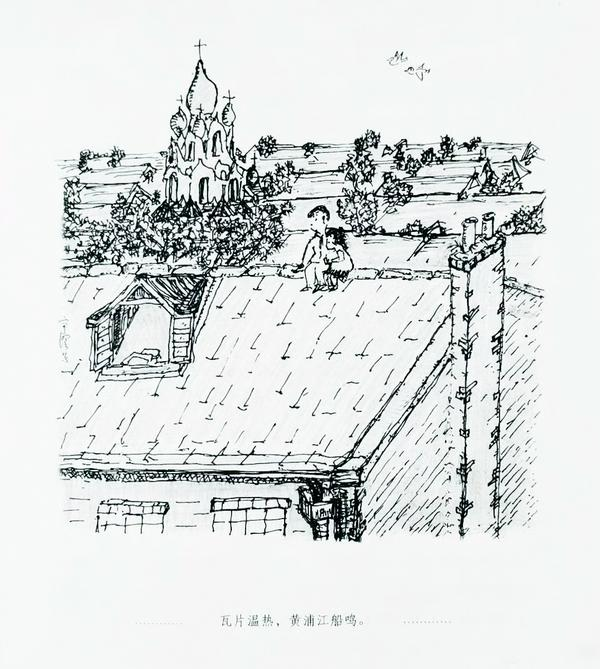

电视里也用光影还原出来了这一幕

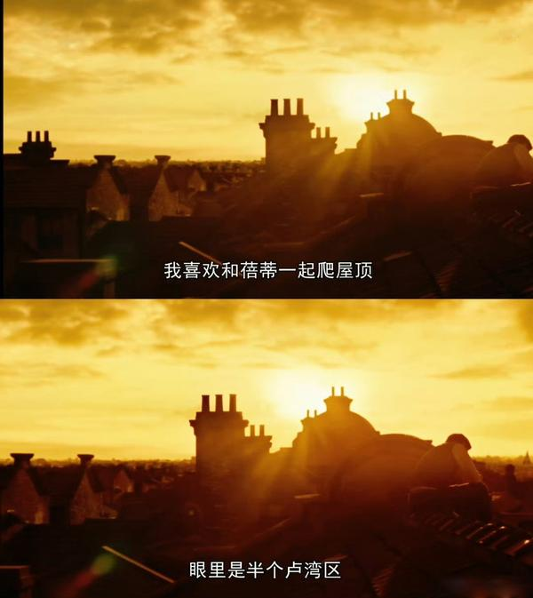

电视里也文字影像化了。 《繁花》里面有那么多的生活细节， 当被问到，你创作《繁花》的目的是什么？ 就是说要消除这些语言上的障碍，使得外地的朋友能够了解，这个上海的市民生活是什么样子。 “以石库门为典型代表的上海老弄堂，拆一处少一处，拆很简单，改造内部，符合现今居住理念， 是麻烦的，却显示了极具文化含量的努力。”金宇澄接受澎湃新闻专访时说， “城市民居真正的记忆需要保留。” 你比如说我到哈尔滨，我过去插队在东北。我到哈尔滨早晨去吃早饭， 朋友带我吃早饭， 说来两斤油条，早饭么，两斤油条。到馆子里边吃饺子也是论斤论半斤，或是怎么样， 这个粮票。 但是上海有几种食品它是半两的，比如说油条，它一根是半两，那么有时候上海人他吃那个泡饭，要用油条蘸酱油，这是一种。 还有比如说小馄饨当时也是半两，那么北方人不知道跑到上海，跑到馄饨店里说，来个半斤馄饨。半斤馄饨就是十碗嘛，十碗端上来他知道不对了。

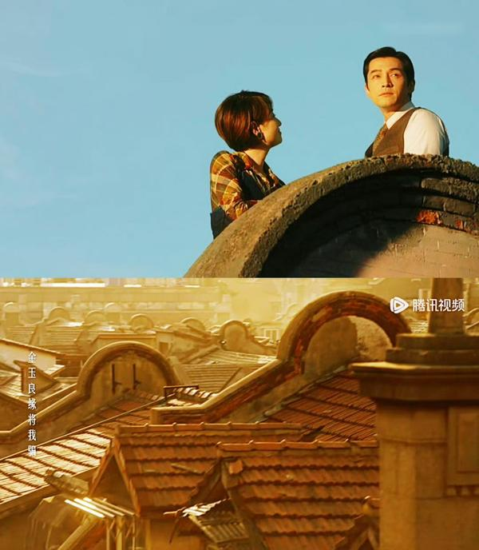

有评论里说， 《繁花》建立了一个文学的博物馆，多少年以后你要回过头来看上海，到小说里找就行了。 然而，历史上海的记忆，随老弄堂、老街道的消失，整个地块建起全国一律的高楼，变得无迹可循。 他只能通过书写和手绘方式，在纸上唤醒，与读者分享。

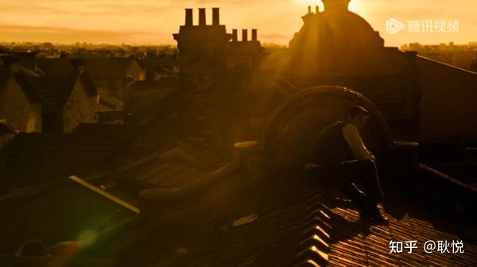

同时，除了写作，金宇澄还一直在画画，办了画展， 描摹上海这座原始森林，不过这一次他不光是用文字， 而是用绘画。 无论采用何种方式，都是他在试图抵御遗忘。

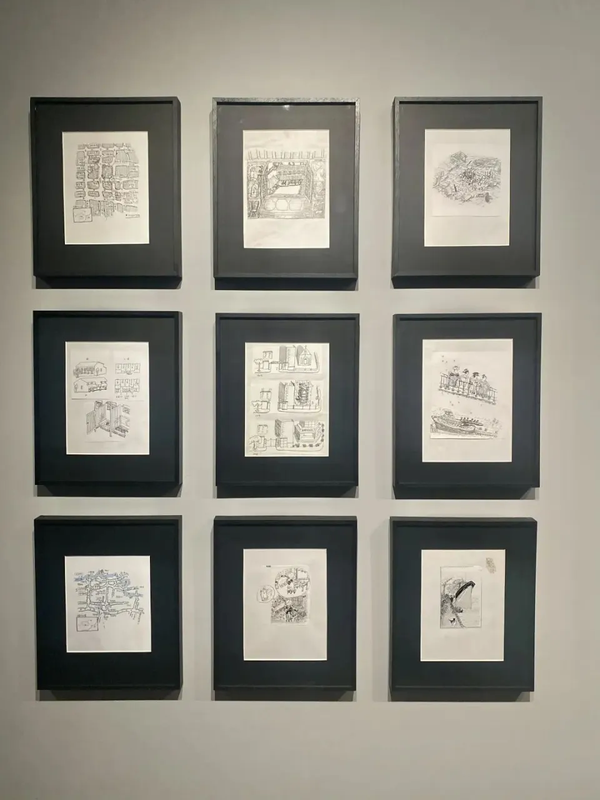

金宇澄繁花插画手稿 看到这些努力，作为创作者/传承者都能明白这份心意吧。 有人说金宇澄文笔不够好，这个真的不敢认同，像他这样的作家，愿意倾注数年时光这样去打磨一部这么好的小说，一字一字写，一笔一笔画，其实是很稀缺的。 看到一个评论： 沪语是一个容易书面表达且语言极度有意思的一个载体； 不同地方使用者书面语的使用习惯会极大丰富此语言文学，包括各地华人的华语写作和方言写作。 又看到一句金的表述： “方言就像一条河流，它每天都在变，但生命力非常强。 而文学的其中一个功能，就是把时间、语言、人物固定下来，我们过了很多年看，‘噢，原来当时是这样的’。” 来自采访《央广记录上海话：爽，嗲，活，灵》

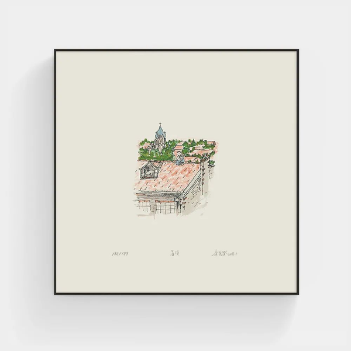

屋顶/金宇澄 所以在布景上，街道上，做生意场所上， 香港，东京，深圳，澳门 这些地方都是适合拍摄的，在不同的人物故事创业和成长背景里， 但上海，和繁花的搭，灵魂气质，无可替代。

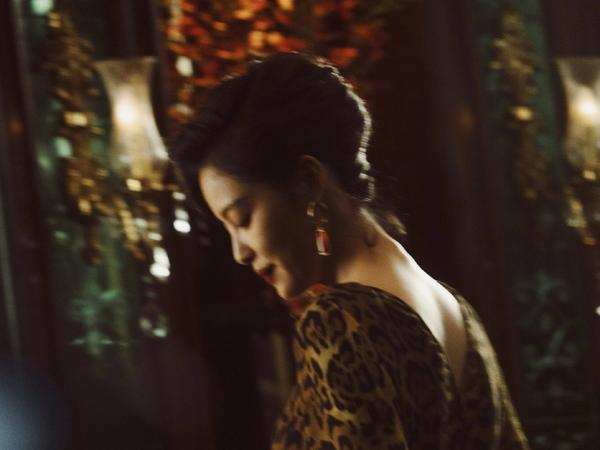

对了，在繁花里有几位个性风采都独特的女性， 那金宇澄为什么用那么多笔墨去描绘女性，展开说太长了。以后要解读再说。

---

## 版权

本文为耿悦原创，版权所有。未经许可不得转载或商业使用。

---

原文链接：[https://www.zhihu.com/question/639094994/answer/3373730836](https://www.zhihu.com/question/639094994/answer/3373730836)
