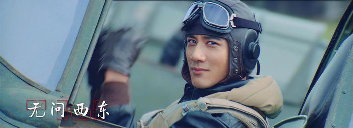
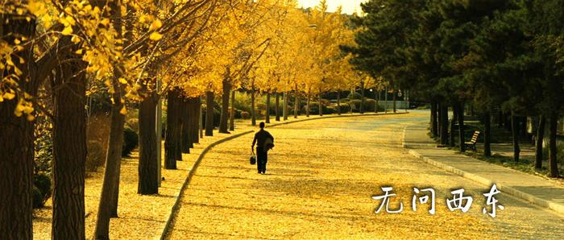
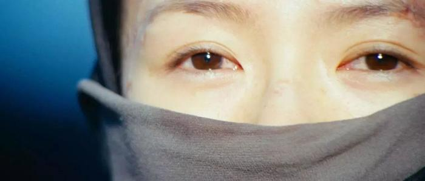
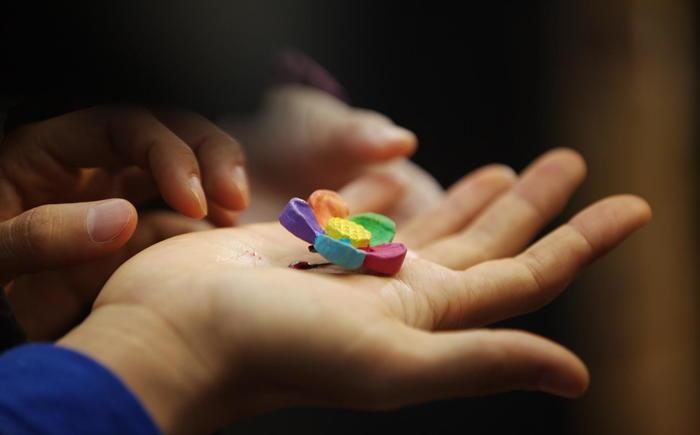
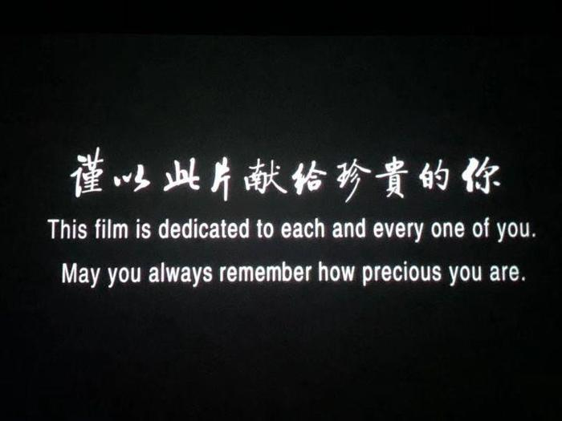
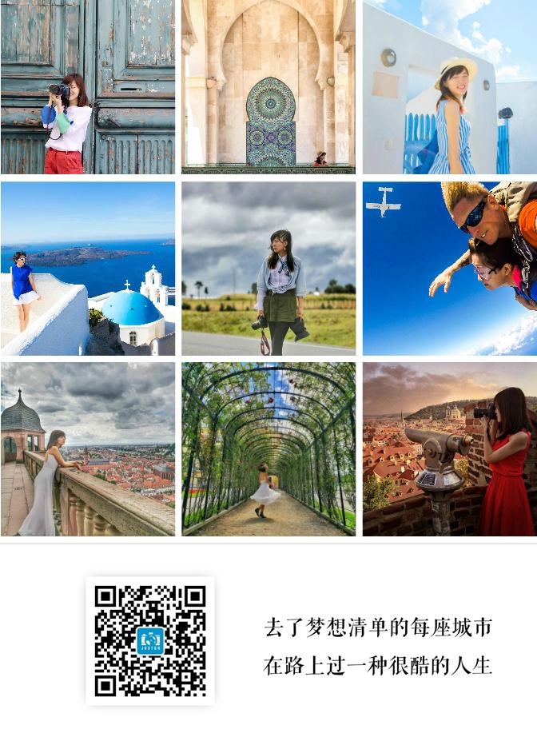

# 无问西东，我看见了一腔珍贵的赤子之心

> 走了那么远，我们去寻找一盏灯。
> 电影结尾的答案是：你留在这世间点滴的善意，会感染你所接触到的人。
> 珍贵如你。无问西东。Forever Young。

---

## 一 · 走了那么远，我们去寻找一盏灯

去看了电影《无问西东》，很喜欢，我和 Danni 临时换到了影院的第一排，虽然有点仰起头，但是大部分时间，都非常享受在那些流动的画面里。

好的故事让你认出自己，好的故事就是光明。我从电影中看到了一种很珍贵的东西，似乎也得到了某种无形的肯定："真实"、"真心真性"。

电影的四段年代戏都是喜欢的，可能最喜欢的是吴岭澜、沈光耀的两卷。虽然时代久远，但扑面而来的是一腔完全理解的赤子之心：就是一颗率直、纯真、善良、热爱生命、好奇而富想象力、生命力旺盛的心，永远年轻，永远热泪盈眶，永远有对这个世界最初的善意。

听到心窝里的是梅贻琦对吴岭澜说，

> "人把自己置身于忙碌当中，有一种麻木的踏实，但丧失了真实。你的青春不过只有这些日子。"
>
> "什么是真实？你看到什么、听到什么、做什么、和谁在一起，有一种从心灵深处满溢出来的不懊悔、也不羞耻的平和与喜悦。"

我在学生时代也是文科很好，理科极差的孩子，写作文极开心，上数学课极害怕，当时所有的老师对学生都是同质化教育，要全面发展，不能偏科。我记得我高三的课堂上一直哭，眼泪流下来，我坐在第一排，数学老师看见了，她嘴唇动了动没有说话继续看试卷，那一年的偏科对我是绝望的，当时如果能懂得这样的话语该多好。

## 二 · 奔赴一场劫难，却像去赴一场盛宴

这是中国近代史上的惊鸿一瞥。艰苦卓绝的战争年代，却充满了理想的少年气。

> "奔赴一场劫难，却像去赴一场盛宴"。

热血而天真的赤子们，以血肉之躯抛洒青春和风骨，为国捐躯奉献，去实现革命理想，在容不下一张书桌的华北，那个时代的教书人可以在暴雨入注时，静坐听雨。在头顶上敌机轰鸣时，还能姿态笔直，气定神闲地跟学生传授思想。

米雪扮演的光耀妈妈仪态很美，落泪也美，她对儿子说，"没有想要你追求功名，那都是一场幻光。只希望你做自己喜欢的事情，读万卷书行万里路，有自己喜欢的姑娘，结婚生子，不是为了我，而是你能享受人生乐趣。"

我被她优雅的语调和落泪打动了，她是一个如此通透的母亲，教育儿子时，希望他听从你心，不希望到他还没有想过这一生怎么过，就失去了性命。其实最终真的失去了儿子，她依然亲自端出冰糖莲子汤让双胞胎兄弟喝完上路。

想到我们现在的条件好出太多了，我们不用生离死别，不用朝不保夕，不用食不果腹，不用在泥浆里奔跑，不用逃离警报炸药，觉得好生活来之不易，更应该珍惜。

## 三 · 不要放弃对生命的思索，对自己的真实

那时那群最卓越的人的名字一个个出现时，我的内心波澜壮阔。那是清华的青春，也是思想百花齐放的时代。

> "世界对你，无意义无目的，却又充满随心所欲的幻想，但又有谁知，也许就在这闷热令人疲倦的正午，那个陌生人，提着满篮奇妙的货物，路过你的门前，他响亮地叫卖着，你就会从朦胧中惊醒，走出房门，迎接命运的安排。"

这是泰戈尔的诗。当我在你们这个年纪，有段时间，我远离人群，独自思索，我的人生到底应该怎样度过？

某日，我偶然去图书馆，听到泰戈尔的演讲，而陪同在泰戈尔身边的人，是当时最卓越的一群人（即梁思成、林徽因、梁启超、梅贻琦、王国维、徐志摩），这些人站在那里，自信而笃定，那种从容让我十分羡慕，而泰戈尔，正在讲"对自己的真实"有多么重要，那一刻，我从思索生命意义的羞耻感中，释放出来，原来这些卓越的人物，也认为花时间思考这些，谈论这些，是重要的。今天，我把泰戈尔的诗介绍给你们，希望你们在今后的岁月里，不要放弃对生命的思索，对自己的真实。

## 四 · 你的善意，继续活着

电影开头有一句话：

> 如果提前了解了你所要面对的人生，你是否还会有勇气前来？

我想了想，有一段时光我觉得我没有，后来的一些时光又觉得值得和期待。

电影结尾告诉我们的答案是：你留在这世间点滴的善意，会感染你所接触到的人，从而让这个社会变得更好一点点。

每个故事，都从后一个年代的故事讲了前一个故事的逝者（泰戈尔、"晃晃"、李想），在说你的躯体总有一天会逝去，但你的思想和你做过的善举，会通过你的读者、学生、子女等不断传承，他们一直没有忘记，这时候，你其实就是以另外一种形态在世界上继续"活着"。

突然想起来以前在职场时，也是这样一个冬天，有一次发生了让一个无辜女同事离职的事情，因为人事缘故吧。当初让她放弃工资快速跳槽过来，来了没几个月又连后路都没留又让离开了。我刚好从她入职就了解她根本没做错什么，可能是招她的人判断错了，这就是在欺负老实人，于是打抱不平地为她出头，觉得这样不对，当时所有人都沉默，因为跟自己没啥关系。这件事的结果是她最后还是离职了，我也没得到什么好的影响。后来过了两三年，有一天她辗转地加上我的微信，说，一直记得那一次帮忙，非常感动，不管我在哪里，都谢谢我。她后来已经回到了老家，我们应该再也不会见面，但在凌冽寒风的北京冬天，曾经给过一个孤身闯荡职场的北漂姑娘，一点点信心、善良和正义的支持，她记忆里还会有点暖意，就不至于都是伤害、无情和冷漠。

……

活在这世间，做一个好人，要比做一个没原则的人，付出更多的代价。可是，做什么会让你真正开心。你要问清楚自己。

> "这个时代缺的不是完美的人，缺的是从自己的内心里给出的真心、正义、无畏和同情。"
>
> "认识自己，忠于自身，交付真心"。

## 五 · Yes

> "看见的和听到的，经常会令你们沮丧。世俗是这样强大，强大到生不出改变它们的念头。可是如果有机会提前了解了你们的人生，知道青春也不过只有这些日子，不知你们是否还会在意那些世俗希望你们在意的事情。
>
> 比如占有多少才更荣耀，拥有什么才能被爱。等你们长大，你们会因为绿芽冒出土地而喜悦，会对初升的朝阳欢呼跳跃，你会给别人善意和温暖。但是却会在赞美别的生命的同时，常常甚至永远的忘了自己的珍贵。
>
> 愿你在被打击时，记起你的珍贵，抵抗恶意；
>
> 愿你在迷茫时，坚信你的珍贵，爱你所爱，行你所行，听从你心，无问西东。"

Danni 在电影结束后，我们告别之前，转头对我说，"你都做到了呀。那些台词，我听到时在想，你不就在过这样的生活吗。"

我觉得自己可能没有她说的那么好，只是一直在追求的路上，但的确在电影院听到娓娓道来念出的台词时，我的心里遥相呼应地出现了"yes"。

珍贵如你。无问西东。Forever Young。

> 作者介绍：悦是一名旅行摄影师。她一直在路上，一年飞行 15 万公里，去了梦想清单里的每个城市，拍心动的瞬间。

> 微博 @ 摄影师耿悦
> 微信公众号 JUSTGO

---

原文链接：[https://zhuanlan.zhihu.com/p/33110984](https://zhuanlan.zhihu.com/p/33110984)
