# 好心情清单 | 活下去的理由

*Geng Yue · Brand Stories*

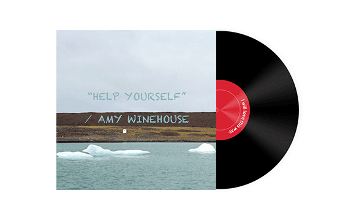

Hello，我突然更新，惊不惊喜，意不意外。

昨天我在整理照片，看到了刷屏的新闻。香消玉殒，重度抑郁。

沉默了一会。翻到好久前写的一条想法。

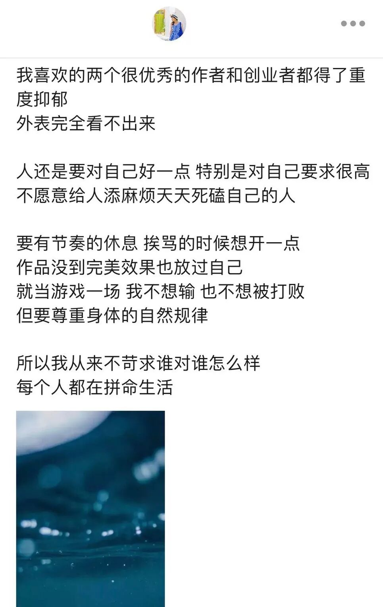

我意识到，**心情好这件事非常非常重要。**

在临睡前，我又读到一本书，名字叫**「活下去的理由」。**作者叫马特·海洛。写的很有意思。

一口气读完，摘抄了一些书摘。送你们当做**「好心情清单」**的第一期吧。

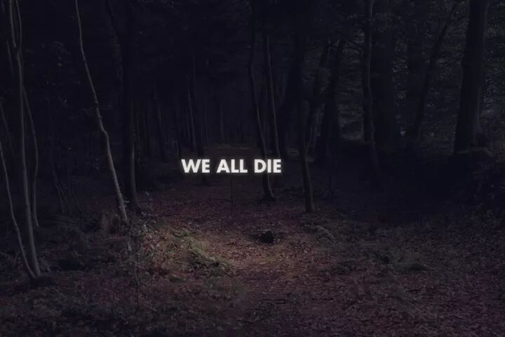

*ps: 这篇配图来自Victoria Siemer，我蛮喜欢的一个艺术项目。看她的作品，仿佛自己站在荒野上大声喊出很丧的话。*

---

### 活 / 下 / 去 / 的 / 理 / 由

**01**

你以为来到了外星球，没人能理解你经受的痛苦。

但实际上，他们理解。你觉得他们不理解，是因为你唯一的参照点是自己。你从未经受过这种痛苦，滑入深渊的冲击令你胆战心惊。然而，还有其他人来过这里。**在那片黑暗之中，有上千万人与你同行。**

**02**

你已经有自杀的想法了，**情况不会变得更糟了，以后只会有上坡路。**

**03**

**你恨自己。这是因为你敏感。估计每个人都会找到恨自己的理由，如果他们想得跟你一样多的话。**其实**我们每个人全都是混蛋，也都是美妙的天使。**

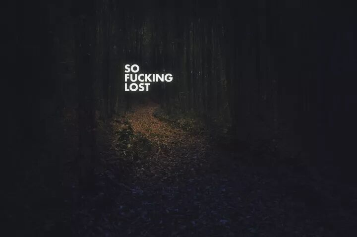

**04**

你有一个标签，"抑郁症"，那又如何？其实如果问对了专业人士，**每个人都会有一个标签。**

**05**

你觉得一切都将变得更糟，但这种感觉只是你的症状。

**06**

头脑有它自己的天气系统。**虽然你现在身处龙卷风之中，但龙卷风的能量最终会被耗尽的。坚持住。**

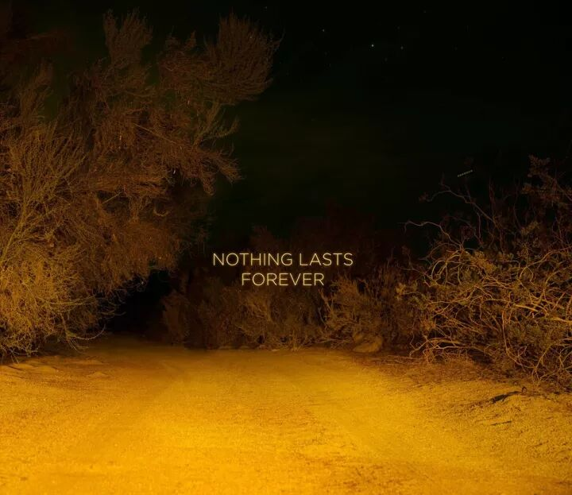

**07**

**无视偏见。**每一种疾病都曾招来偏见。我们害怕得病，于是恐惧滋生偏见。比如，脊髓灰质炎曾被错误地指为穷人才会患的疾病。而抑郁症常被人认为是一种"软弱"或性格缺陷。

**08**

没有什么会一成不变。现在这种痛苦不会永远持续。如果痛苦告诉你它会持续，是它在撒谎。其实痛苦是一笔债，可以用时间偿清。

**09**

头脑会变。性格会变。我在《人类》（The Humans）中写过："你的头脑是一个星系，**黑暗比光明多，但光明是值得等待的**，所以不要结束自己的生命，即使黑暗是全部。要知道生命不是静止的，时间也是空间，你在时间的星系中移动，**等待那恒星。**"

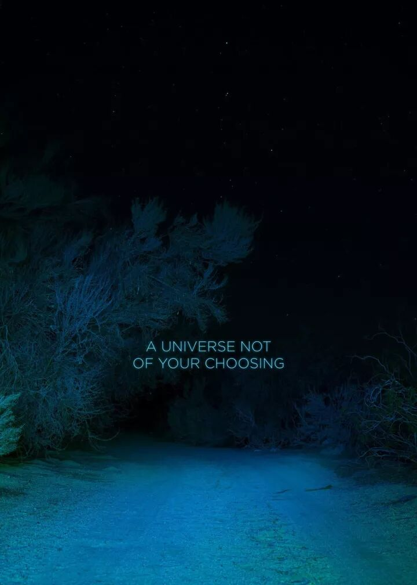

**10**

有一天，你会体验到与这痛苦相等的喜悦。听海滩男孩的歌曲，你会流下欢欣的泪。你会俯身凝视怀里婴儿酣睡的脸，你会结识很多好朋友，你会品尝从没吃过的美食，你会在高处俯览美景，不去考虑从这里掉下去摔死的可能性。还有很多书你没有读过，它们会让你更充实。你会吃着超大份爆米花看很多电影。你会跳舞、大笑、做爱、沿着河岸跑步、聊天到深夜、笑到肚子疼。生活在等待着你。虽然你现在被短暂地困在这里，但世界哪儿都不去。

如果可以，坚持下去。活着总是值得的。

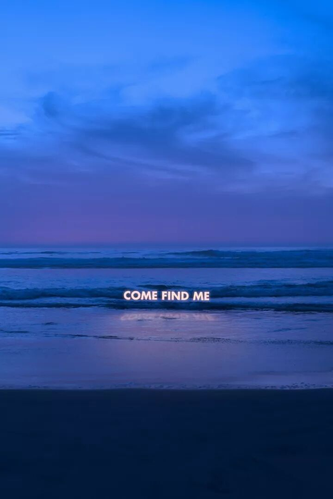

---

### Yue's Word

我阅读时被激发出三个思维角度：

**01 思维角度的转换**

我曾在另一篇文章里分享过一个观点：**最近我渐渐把「这件事情为什么要发生在我身上？」的想法替换成，「这件事情是想要教会我什么？」然后发现身边的一切都改变了。** ——以前看治疗抑郁症的书，**本质就是转换思维角度。**

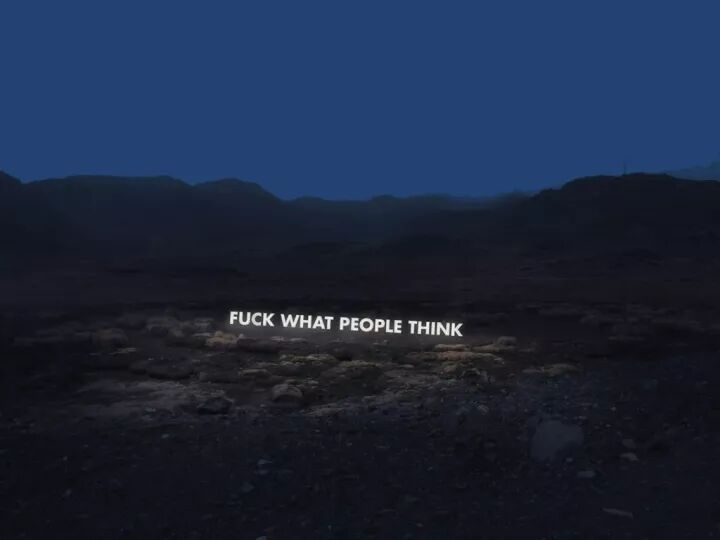

在「活下去的理由」里作者也写到一章：

「那些极其糟糕的日子，虽然很恐怖、很难熬过去，但日后却可以派上用场。你把它们存起来，**建立一个糟糕日子银行。**那个你不得不从超市逃跑的日子，那个你抑郁到动不了舌头的日子，那个你让父母流泪的日子，那个你差点跳崖自尽的日子。等到你遇到下一个糟糕的日子，你就可以说，好吧，今天是够糟糕的，但之前还有过比这更糟的日子啊。**即使今天就是你经历过最糟的日子，至少你知道银行还在那里，你至少存了一笔。**」

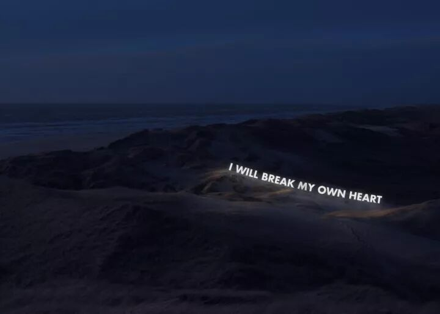

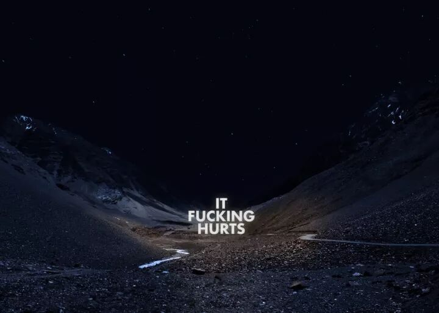

**02 和手机另一端连接的人才重要**

曾经读到过，大部分选择自杀的人，虽然有各种不同的理由，但是究其本质都有一个共同点：觉得这个世界和自己没关系了。

「生活的意义在于爱你的人。没有谁会为了一部苹果手机活着，手机另一端连接的人才重要。一旦我们开始复原，重新找到生命的意义，我们会长出一双全新的眼睛。我们会看得更清晰，开始察觉到过去无法察觉的东西。」

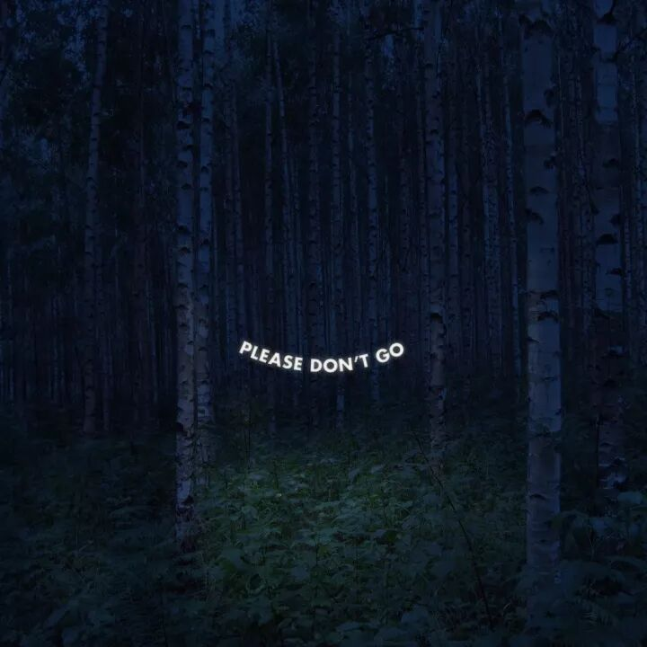

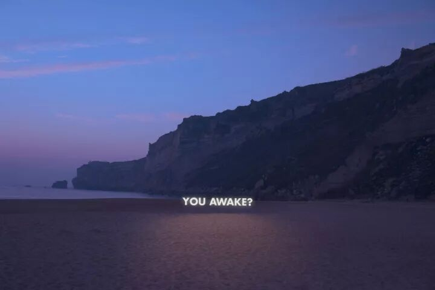

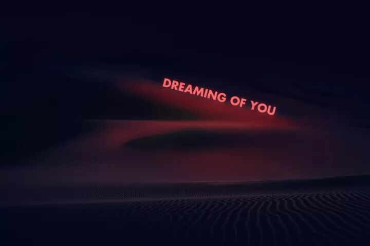

**03 Up & Down**

人生就是起起伏伏的。高光时刻并不是常态。他写道：

然而，随着时光流逝，我懂了一些以前不懂的道理。我懂得向下不是唯一的方向。如果你坚守在那里，忍耐住，情况会变好的。**会变好，然后又变糟，然后又变好。**

正如我住在父母家里时，一个顺势疗法医生告诉我的，**"高峰，低谷，高峰，低谷。"如果可以，坚持下去，活着总是值得的。**

---

再送上一首昨晚循环的歌。**薛岳的「如果还有明天」**

这首歌背后的故事是：原唱是一个七八十年代的"台湾摇滚之父"，在他三十多岁时，被证实癌症末期。他朋友刘伟仁创作了这首歌送给他。一直录了三遍才完成，因为要等前两次薛岳哭尽眼泪，才有气力开口唱歌。

**「如果还有明天，你想怎么装扮你的脸。如果没有明天，要怎么说再见。」**

在我决定来北京之前下决心的时光里，我每天跑步时耳机里循环播放着这首歌。里面的歌词，你们可以听一听。

晚安了。明天见。

---

原文链接：[https://zhuanlan.zhihu.com/p/507890883](https://zhuanlan.zhihu.com/p/507890883)
