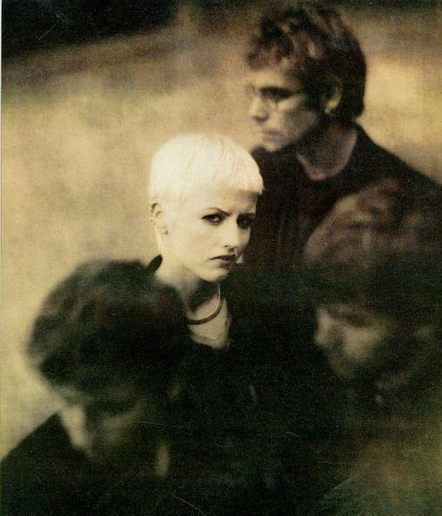
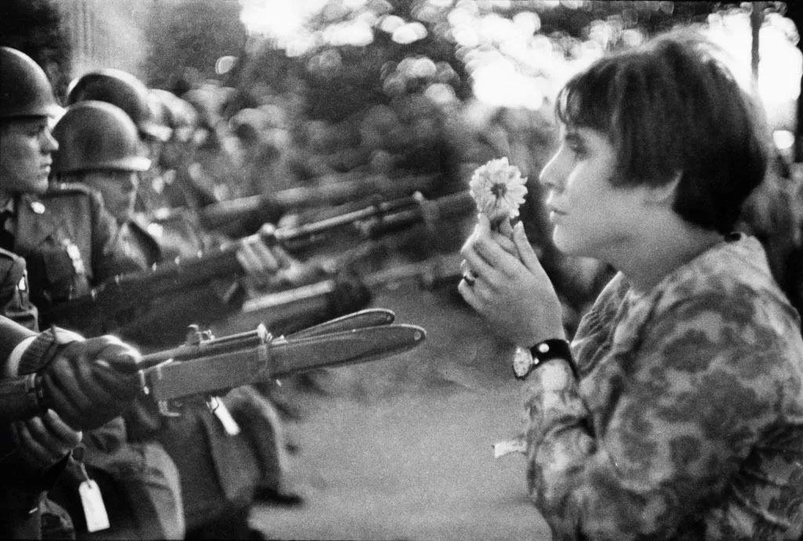
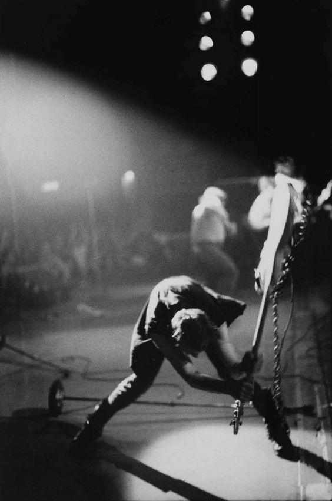
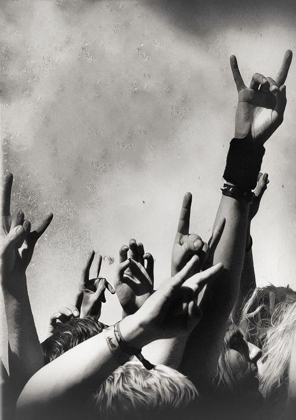
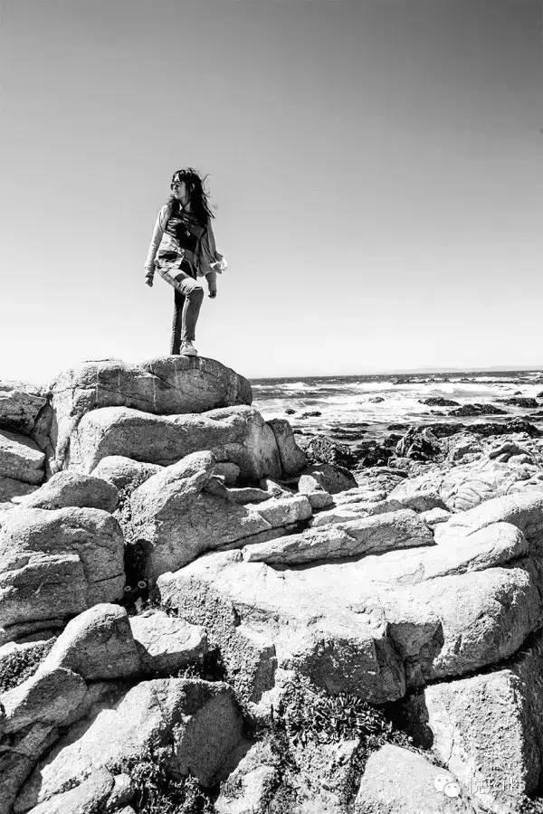

# 那些平凡的青春日子，我带着耳机听小红莓。

*耿悦 · yuetalks · 2018-01-16*

---

旧文。写于近三年前的冬日。

## 1 再见，Dolores O'Riordan。
小红莓The Cranberries的乐队主唱桃乐丝突然在伦敦去世了，很年轻，才46岁。
从半夜确认了这个新闻，到此刻我都一直在循环《Zombie》，《Dying in the sun》，我的脑子里还在重复着"不愿相信"与"怎么会呢"？！

我意识到我的某个时代／记忆逝去了。
小红莓，曾经是我青春／年轻的一部分。
我想，你也是的。
**你是在什么时候爱上她的声音的？**
**那段时间你听歌是个什么样的场景？**
我是在工作后每天循环听她们的歌。
当时我还是一个其貌不扬的图片编辑，二十来岁的每一天，我好像都在工作。
跟你们后来看到的我环游世界彩色的旅行照片俨然不同，那时候每天上班我只穿黑白灰。
当我正在经历一生中最年轻、也是最平庸的年华时，无处安放的情绪，每天都让一个年轻人自卑、迷茫、愤怒。

我有一个只有自己知道的小习惯。
我们每天都需要坐班，需要朝九晚五规规矩矩的，
我一边打开国外LIFE杂志老照片，一边带上耳机，豆瓣FM里循环播放着小红莓的又酷又迷幻的歌，一首接一首。
我坐在办公室里，表面沉静乖巧，心里热血沸腾飞扬，在反差中，编辑着许多经典的国外摄影故事图集。

有一次整理历史图片选题，我看着马克·吕布的摄影名作《枪炮与鲜花》，17岁女孩简·罗斯(Jan Rose Kasmir)在反战游行中，用鲜花对抗枪炮的经典时刻，耳机里循环着反战歌「Zombie」的歌词：
*In your head,在你的头脑之中*
*In your head they're still fighting人们仍在自相残杀*
*With their tanks ,and their bombs 用他们的坦克炸弹*
*And their bombs, and their guns 用他们的钢枪铜炮*
……
我喜欢Dolores的声音、旋律和歌词，喜欢她的长相、台风和气质。
她给我的印象是，特立独行，才华横溢，有仙气，很酷。
她光头站在伍德斯托克音乐节的台上实在是太酷了。
那是我当时生活中为数不多的特立独行，是我黑白灰世界里的迷离闪烁的灵感。
*And then I open up and see 我敞开心扉，睁大眼睛*
*the person falling here is me, 发现自己不知所措*
*A different way to be. 究竟何去何从*
*……*
*And they'll come true,梦想终究会实现*
*impossible not to do,不会迷惘永远*
*"你是否准备好回到过去的梦里？你是否准备好追逐自己的梦想？"*

## 2 Dreaming my dreams
循环播放The Cranberries之后的那些个夏天，我和我的大部分朋友们都是文艺青年。
我窝在蜂巢剧场和木马剧场，看完了在那个夏天上演的几乎全部的话剧。
每天下班后，会看一部电影，有一个月，我在看伍迪·艾伦、费里尼，然后看杨德昌和侯孝贤....沉浸在那些年代日远的迷人故事里，日子一天天鲜明温柔。
有一次，北京下很大的雨，我趟着水去麻雀瓦舍听民谣，鞋帽尽湿，歌手是位盲人，走到台上说了一句，好的音乐能把你们的衣服和心烘干。
我一边听，一边在黑暗里一起念，青春是一条静水深流的河。

也听演唱会，Bob Dylan，Suede…在那些下班的晚上和周末四处转，看伍德斯托克音乐节的纪录片，点滴的愉悦。
有一阵，我有点迷恋抓拍很酷的摇滚歌手的瞬间，在愚公移山、Mao Live House看外国小众歌手的演出。
有一年五月，我和Killar，流浪汉等朋友跑去迷笛音乐节做官方摄影师玩，三天从早拍到晚，在歇斯底里的尖叫和点燃的火焰中精疲力竭。
然而我还是有一生的遗憾，就是错过了The Cranberries北京的演唱会，2011年刚进入了一份新工作沉浸在巨大的压力里，对于心爱的活动还是"错过了"。
年轻的灵魂，在各个角落成长，从北五环或者西四环，汇聚到东四的胡同里，亮马桥的汽车公园里...恋爱、游泳、散步、请客吃饭、在月光下弹吉他听歌，在路边的烤肉摊撸串喝酒，在每一个咖啡馆流泪告别。
一群人在只有一盏路灯的草地上跳舞，轻盈欢快，芬芳招展。
那好像是一个时代，你飘在云朵上，云上的日子，让你忘却阳光下的心事。

## 3 When You're Gone Dying in the sun
当你开始对时间有充分敬畏，当你理解了其中滋味，才明白它碾压的残酷。
突然有一天，那些充斥在我生活中的演出、活动、喧闹变得不再重要了。
有一天晚上我在朋友圈打开看了一个吴吞的视频，竟然看哭了，都不知道眼泪怎么就流出来了。想起来几年前，麻雀瓦舍里，一万个名字。还有周云蓬和小河在台上唱歌。年轻人站的密不透风，挤在台下，过了十二点还不愿散去，听歌取暖。这样的冬夜，暂时忘记了外面的天寒路远。

*\1*

那会儿一块听歌的朋友们很久没联络了，有很多都离开北京了。
有一天，我发现自己就住在麻雀瓦舍旁边，但是，我似乎再也没有去关注过一场演出，只是在附近喝过一碗粥，买过几回菜。
后来麻雀也关门了，我也很少冷飕飕地跑出去看演出了。
去年在家看诺贝尔颁奖礼表演的视频，当年要Fuck the World操翻全世界的朋克教母帕蒂史密斯Patti Smith如今一头白发，羞涩腼腆，唱错了歌词，数次对观众说"Sorry"，我看哭了。
她唱着"And it's a hard, and it's a hard, it's a hard,it's a hard. And it's a hard rain's a-going to fall."
我想起我爱着Bob Dylan的那些日子，那些甜蜜的像左耳播放小红莓《Dreams》右耳播放《Blowin' in the Wind》的俏皮共鸣。

*\1*

*\1*

我不得不承认，那些弹琴把老歌唱的夜晚，那些笃信永远年轻永远热泪盈眶的时光，离开了我。这变化就在一瞬间。
它悄然来临，我全盘接受。
**我们还可以在某些时刻热泪盈眶一会，但不会永远年轻了。**
不再激烈的为了一个问题的争论，手捧着手机打字到手酸。
不再为了争一口气，任性地一次次拿不起放不下离不开。
不再为了实现一个念头猛撞南墙。
不再喜欢话痨般地说话，似乎说出来，内心深处里有一片东西就挥发在空气里，安静才能养气。
生活里多了些专注、内省的时光，顿觉平淡的时光非常奢侈。
我现在是旅行者，一个践行着说走就走的人。
但是，说句实话，我心里很清楚，人真的会越来越顾虑，越来越没有当年的勇敢。
我也想去，也想做，可是。
你现在会在前面加一个可是，有很多可是啊。
你的双脚以前是轻盈的，如今双脚好像被泥泞黏住了慢慢往下陷。想跑，脚下却拖泥带水。越知道生活不容易，就越明白梦想的奢侈。
我真的已经好久没再听小红莓，或许我已经老了，只懂得那些爱过的東西。 而那些爱过的东西都一一在逝去。
我现在正做的事情——捕捉美，这不也是对流逝的对抗吗。
小红莓《zombie》的live版再回到那个热血沸腾又迷幻的年代
每个人心里都有一个小红莓乐队。
我的青春里不能没有他们。
R.I.P.
Hope you never grow old.

我爬上美国加州一号公路的Rock上想rock生活。那会我还总去摇滚现场，刚拍完三天的迷笛音乐节摇滚现场。
作者介绍：悦是一名旅行摄影师。她一直在路上，一年飞行15万公里，去了梦想清单里的每个城市，拍心动的瞬间，写真诚的故事，分享闪光的旅行灵感。在路上过一种很酷的人生。
写于2018.01.16

---

*旧文。写于 2018-01-16，纪念小红莓主唱 Dolores O'Riordan。*
